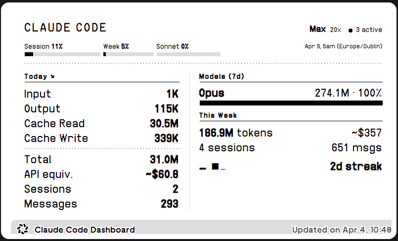

# claude-trmnl

Advanced Claude Code usage dashboard for [TRMNL](https://usetrmnl.com) e-ink displays.



Reads local Claude Code session data and optionally scrapes live usage limits via PTY. Cross-platform (Windows, macOS, Linux). Only stdlib + optional `pywinpty` (Windows) or `pexpect` (Unix).

## What it shows

| Metric | Description |
|--------|-------------|
| **Subscription** | Plan type (Pro/Max) and rate limit tier (5x/20x) |
| **Usage limits** | Session %, weekly %, Sonnet % with progress bars and reset time |
| **Active sessions** | Currently running Claude Code instances |
| **Today's tokens** | Input, output, cache read, cache write breakdown |
| **API-equivalent cost** | What today's usage would cost at API prices |
| **Session & message counts** | How many sessions and messages today |
| **Model breakdown** | Per-model usage with percentage bars (7-day) |
| **Weekly totals** | Tokens, cost, sessions for the current week |
| **7-day sparkline** | Visual activity trend |
| **Usage streak** | Consecutive days of Claude Code usage |
| **Top project** | Most active project by token usage |
| **Trend indicator** | Up/down/flat vs yesterday |

## How it works

```
~/.claude/
  .credentials.json   -->  subscription type + tier
  sessions/*.json     -->  active session count
  projects/**/*.jsonl  -->  token usage per message

claude CLI (via PTY)  -->  session/weekly usage % + reset times
        |
   claude_trmnl.py
        |
   POST merge_variables
        |
   trmnl.com/api/custom_plugins/{UUID}
        |
   TRMNL renders Liquid template to PNG
        |
   e-ink display pulls image on next wake
```

## Setup

### 1. Create the TRMNL plugin

1. Go to your [TRMNL dashboard](https://usetrmnl.com) > **Plugins** > **Private Plugin**
2. Name it "Claude Code Dashboard"
3. Set strategy to **Webhook**
4. Copy the **Plugin UUID** from the settings
5. Paste the template from `templates/full.html` into the markup editor

Other template sizes available: `half_horizontal.html`, `half_vertical.html`, `quadrant.html`

### 2. Install dependencies (optional)

For live usage limit scraping:

```bash
# Windows
pip install pywinpty

# macOS/Linux
pip install pexpect
```

Without these, the dashboard still works -- it just won't show the session/weekly usage percentages. Use `--no-scrape` to skip.

### 3. Configure

Set your Plugin UUID. Pick **one** of these approaches:

**Option A: Environment variable (recommended)**

Set `TRMNL_PLUGIN_UUID` as a system environment variable:
- **Windows**: Settings > System > About > Advanced system settings > Environment Variables > New
- **macOS/Linux**: add `export TRMNL_PLUGIN_UUID="your-uuid"` to `~/.bashrc` or `~/.zshrc`

**Option B: Wrapper script**

Create a `run.bat` (Windows) or `run.sh` (macOS/Linux) in the project folder:

```bat
@rem run.bat (Windows)
set TRMNL_PLUGIN_UUID=your-uuid-here
py claude_trmnl.py --no-scrape
```

```bash
# run.sh (macOS/Linux)
export TRMNL_PLUGIN_UUID="your-uuid-here"
python claude_trmnl.py
```

### 4. Run

```bash
# Test locally (prints JSON, does not post)
python claude_trmnl.py --dry-run

# Post to TRMNL (with usage limit scraping, ~20 sec)
python claude_trmnl.py

# Post without scraping (faster, ~1 sec, skips usage %)
python claude_trmnl.py --no-scrape

# Preview with sample multi-model data
python claude_trmnl.py --test
```

### 5. Schedule

Run every 5-10 minutes to keep your display updated.

**Windows (Task Scheduler):**

If using a wrapper script:
```powershell
$action = New-ScheduledTaskAction -Execute "C:\path\to\claude-trmnl\run.bat" `
  -WorkingDirectory "C:\path\to\claude-trmnl"
$trigger = New-ScheduledTaskTrigger -Once -At (Get-Date) `
  -RepetitionInterval (New-TimeSpan -Minutes 5)
$settings = New-ScheduledTaskSettingsSet -AllowStartIfOnBatteries
Register-ScheduledTask -TaskName "claude-trmnl" `
  -Action $action -Trigger $trigger -Settings $settings
```

If using a system environment variable:
```powershell
$action = New-ScheduledTaskAction -Execute "python" `
  -Argument "claude_trmnl.py" `
  -WorkingDirectory "C:\path\to\claude-trmnl"
$trigger = New-ScheduledTaskTrigger -Once -At (Get-Date) `
  -RepetitionInterval (New-TimeSpan -Minutes 5)
$settings = New-ScheduledTaskSettingsSet -AllowStartIfOnBatteries
Register-ScheduledTask -TaskName "claude-trmnl" `
  -Action $action -Trigger $trigger -Settings $settings
```

**Linux/macOS (cron):**
```bash
# crontab -e
*/5 * * * * cd /path/to/claude-trmnl && ./run.sh
```

**macOS (launchd):**
```xml
<!-- ~/Library/LaunchAgents/com.claude-trmnl.plist -->
<?xml version="1.0" encoding="UTF-8"?>
<!DOCTYPE plist PUBLIC "-//Apple//DTD PLIST 1.0//EN" "http://www.apple.com/DTDs/PropertyList-1.0.dtd">
<plist version="1.0">
<dict>
  <key>Label</key><string>com.claude-trmnl</string>
  <key>ProgramArguments</key>
  <array>
    <string>/bin/bash</string>
    <string>-c</string>
    <string>cd /path/to/claude-trmnl &amp;&amp; ./run.sh</string>
  </array>
  <key>StartInterval</key><integer>300</integer>
  <key>RunAtLoad</key><true/>
</dict>
</plist>
```

## License

GPL-3.0 -- see [LICENSE](LICENSE)
