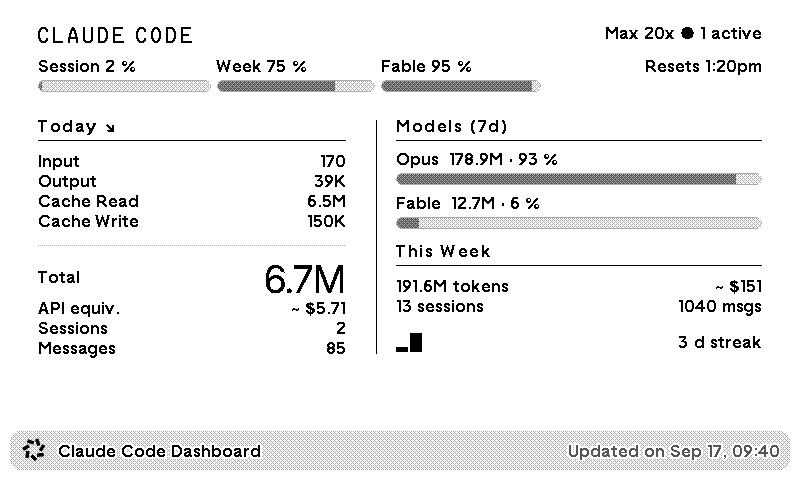

# claude-trmnl

Advanced Claude Code usage dashboard for [TRMNL](https://usetrmnl.com) e-ink displays.



Reads local Claude Code session data and pulls live usage limits from the API's rate-limit headers. Several machines can share one display and have their numbers added up. Cross-platform (Windows, macOS, Linux). Stdlib only. The fallback usage scraper needs `pywinpty` (Windows) or `pexpect` (Unix).

## What it shows

| Metric | Description |
|--------|-------------|
| **Subscription** | Plan type (Pro/Max) and rate limit tier (5x/20x) |
| **Usage limits** | Session %, weekly % and any per-model cap, with progress bars and reset time |
| **Active sessions** | Currently running Claude Code instances |
| **Today's tokens** | Input, output, cache read, cache write breakdown |
| **API-equivalent cost** | What today's usage would cost at API prices |
| **Session & message counts** | How many sessions and messages today |
| **Model breakdown** | Per-model usage with percentage bars (7-day) |
| **Weekly totals** | Tokens, cost, sessions for the current week |
| **7-day sparkline** | Visual activity trend |
| **Usage streak** | Consecutive days of Claude Code usage |
| **Top project** | Most active project by token usage |
| **Trend indicator** | Up/down/flat vs yesterday |

## How it works

```
~/.claude/
  .credentials.json   -->  subscription type + tier
  sessions/*.json     -->  active session count
  projects/**/*.jsonl  -->  token usage per message

api.anthropic.com     -->  session/weekly usage % + reset times
  (rate-limit headers)      (falls back to the /usage TUI over a PTY)
        |
   claude_trmnl.py  <--ssh-->  other machines, if fleet.json says so
        |
   POST merge_variables
        |
   trmnl.com/api/custom_plugins/{UUID}
        |
   TRMNL renders Liquid template to PNG
        |
   e-ink display pulls image on next wake
```

## Setup

### 1. Install dependencies (optional)

Nothing to install for the default setup. The usage limits come from rate-limit headers the API returns on any request, which the stdlib can read on its own.

The fallback scraper reads the same numbers out of the `/usage` TUI and does need a PTY library:

```bash
# Windows
pip install pywinpty

# macOS/Linux
pip install pexpect
```

Use `--no-scrape` to leave the usage limits out entirely.

### 2. Configure

Set your Plugin UUID. Pick **one** of these approaches:

**Option A: Environment variable (recommended)**

Set `TRMNL_PLUGIN_UUID` as a system environment variable:
- **Windows**: Settings > System > About > Advanced system settings > Environment Variables > New
- **macOS/Linux**: add `export TRMNL_PLUGIN_UUID="your-uuid"` to `~/.bashrc` or `~/.zshrc`

**Option B: Wrapper script**

Create a `run.bat` (Windows) or `run.sh` (macOS/Linux) in the project folder:

```bat
@rem run.bat (Windows)
set TRMNL_PLUGIN_UUID=your-uuid-here
py claude_trmnl.py --no-scrape
```

```bash
# run.sh (macOS/Linux)
export TRMNL_PLUGIN_UUID="your-uuid-here"
python claude_trmnl.py
```

### 3. Run

```bash
# Test locally (prints JSON, does not post)
python claude_trmnl.py --dry-run

# Post to TRMNL
python claude_trmnl.py

# Post without the usage limits
python claude_trmnl.py --no-scrape

# Force one method or the other (see "Reading the usage limits" below)
python claude_trmnl.py --usage-method pty

# Preview with sample multi-model data
python claude_trmnl.py --test

# Post this machine's stats alone, ignoring fleet.json
python claude_trmnl.py --no-fleet
```

### How the token numbers are counted

Claude Code writes one JSONL line per content block, and every line repeats the whole message's usage. A reply with thinking, text and a tool call therefore lands three times. Resumed and forked sessions copy their history into a new file on top of that. Counting lines would multiply every figure on the display, so the scan folds entries by message and request id first.

Days are local, not UTC, so "today" ends when your clock says it does.

Costs are what the same tokens would have cost at API list prices. A subscription doesn't charge per token, so treat the figure as a comparison rather than a bill. Cache writes cost 1.25x input at the 5-minute TTL and 2x at the 1-hour one, and each message records which it used. Models the script doesn't recognize, one proxied through a gateway for instance, fall back to Sonnet rates.

### Reading the usage limits

The session and weekly percentages come from `anthropic-ratelimit-unified-*` response headers, which every API response carries. Getting them means one `max_tokens: 1` request, which takes about half a second and spawns no `claude` process.

`--usage-method` picks how to read them:

| Value | What it does |
|-------|--------------|
| `auto` (default) | Headers every run, plus a cached per-model row (see below) |
| `headers` | Headers only, no PTY at all |
| `pty` | Drives the `/usage` TUI over a PTY, as earlier versions did |

No header reports the per-model weekly row. Plans that cap one model separately show a third bar in `/usage`, labelled with whichever model that is (Fable at the time of writing, Sonnet before it). That is often the limit you actually run into first, so `auto` reads session and week from the headers on every run and refreshes just that one row from the TUI on a slower schedule, caching it in between.

The refresh interval backs off when there's nothing to watch and tightens when there is: every 60 minutes normally, every 15 once the row is above 80%. `--model-limit-ttl MIN` overrides both. A cached row older than 6 hours is dropped rather than shown, because a weekly limit resets and a stale 95% after a reset is worse than a blank.

So a typical run costs half a second, and roughly one run an hour costs 20 seconds. `--usage-method headers` skips the PTY entirely if you would rather not pay that.

Two other things to know about the header method:

- **It spends a token to measure tokens.** One per run, which also nudges the number it reports by a rounding error's worth.
- **The headers are undocumented**, so they may change. That's the other reason the PTY scraper is still here rather than deleted.

Anything that spawns `claude` on a short interval should also set `DISABLE_AUTOUPDATER=1`, which the PTY path now does for its own spawns. A scraper session lives about 25 seconds, which isn't long enough for the auto-updater to finish downloading a release. On a 5-minute schedule it restarts that download every run and leaves a truncated binary in `~/.cache/claude/staging` each time. Those only get cleaned up after an update that succeeds, so they accumulate. Interactive sessions and `claude update` are unaffected.

### Sharing one display between machines

TRMNL keeps the last payload it received. Two machines each posting their own numbers means the display shows whichever arrived most recently, flipping between halves of the picture instead of adding them together.

`fleet.json` fixes that. Copy `fleet.example.json` to `fleet.json` on every machine, with identical contents:

```json
{
  "master": "workstation",
  "takeover_after_min": 45,
  "stale_after_min": 60,
  "hosts": [
    { "name": "workstation" },
    { "name": "laptop", "ssh": "laptop.local", "cmd": "~/trmnl-claude/run.sh" }
  ]
}
```

`name` has to match `hostname -s`. Without the file nothing changes, and the script posts its own stats the way a single-machine install always has.

The master does the collecting. Each run it scans its own `~/.claude`, runs `ssh <host> run.sh --emit-store` against the others, merges what comes back and posts the sum. Secondaries scan themselves, leave the result where the master can pick it up, and stay off the display. Only one ssh direction needs to work, master to secondary, with key auth. Nothing connects back the other way.

Hosts trade per-day, per-model and per-project aggregates rather than finished figures. A streak, a sparkline and a top project can't be reconstructed from two rendered totals. Session ids union rather than add, so a session spanning two machines counts once.

If the master goes down, a secondary posts in its place. The master pushes the merged store to every host after each post, and that file carries the time of the last post, so a secondary decides by reading a local file rather than probing a machine that may be off. Once that timestamp is older than `takeover_after_min`, it posts its own fresh scan next to the last figures it holds for everyone else. The store is keyed by host, so it replaces its own entry and leaves the others untouched, which is what stops a takeover counting itself twice. When the master returns it collects those stores, keeps the newest entry per host, and carries on.

The title bar shows how many hosts reported, `2/2`. A host whose numbers are older than `stale_after_min` stops counting as present and no longer contributes active sessions, though the tokens it already reported still count toward the week. Watch that marker. A machine that quietly stops reporting looks exactly like a quiet day otherwise, which is the failure this whole arrangement exists to prevent.

Keep the timer running on every machine. A secondary finishes in under a second once it has saved its scan.

One assumption worth knowing: hosts hold different transcripts. Per-response dedupe runs within a host, not across them, so syncing `~/.claude` between machines with something like Syncthing would count the shared sessions on both.

### 4. Schedule

Run every 5-10 minutes to keep your display updated.

**Windows (Task Scheduler):**

If using a wrapper script:
```powershell
$action = New-ScheduledTaskAction -Execute "C:\path\to\claude-trmnl\run.bat" `
  -WorkingDirectory "C:\path\to\claude-trmnl"
$trigger = New-ScheduledTaskTrigger -Once -At (Get-Date) `
  -RepetitionInterval (New-TimeSpan -Minutes 5)
$settings = New-ScheduledTaskSettingsSet -AllowStartIfOnBatteries
Register-ScheduledTask -TaskName "claude-trmnl" `
  -Action $action -Trigger $trigger -Settings $settings
```

If using a system environment variable:
```powershell
$action = New-ScheduledTaskAction -Execute "python" `
  -Argument "claude_trmnl.py" `
  -WorkingDirectory "C:\path\to\claude-trmnl"
$trigger = New-ScheduledTaskTrigger -Once -At (Get-Date) `
  -RepetitionInterval (New-TimeSpan -Minutes 5)
$settings = New-ScheduledTaskSettingsSet -AllowStartIfOnBatteries
Register-ScheduledTask -TaskName "claude-trmnl" `
  -Action $action -Trigger $trigger -Settings $settings
```

**Linux/macOS (cron):**
```bash
# crontab -e
*/5 * * * * cd /path/to/claude-trmnl && ./run.sh
```

**macOS (launchd):**
```xml
<!-- ~/Library/LaunchAgents/com.claude-trmnl.plist -->
<?xml version="1.0" encoding="UTF-8"?>
<!DOCTYPE plist PUBLIC "-//Apple//DTD PLIST 1.0//EN" "http://www.apple.com/DTDs/PropertyList-1.0.dtd">
<plist version="1.0">
<dict>
  <key>Label</key><string>com.claude-trmnl</string>
  <key>ProgramArguments</key>
  <array>
    <string>/bin/bash</string>
    <string>-c</string>
    <string>cd /path/to/claude-trmnl &amp;&amp; ./run.sh</string>
  </array>
  <key>StartInterval</key><integer>300</integer>
  <key>RunAtLoad</key><true/>
</dict>
</plist>
```

### 5. Live updates with Claude Code hooks (optional)

You can have Claude Code automatically push dashboard updates while you're actively using it. Add a `Stop` hook to `~/.claude/settings.json` (fires after each response, so the dashboard stays fresh during active work):

```json
{
  "hooks": {
    "Stop": [
      {
        "matcher": "",
        "hooks": [
          {
            "type": "command",
            "command": "cmd /c start /min /b py C:\\path\\to\\claude-trmnl\\claude_trmnl.py --debounce 5"
          }
        ]
      }
    ]
  }
}
```

On macOS/Linux:
```json
{
  "hooks": {
    "Stop": [
      {
        "matcher": "",
        "hooks": [
          {
            "type": "command",
            "command": "python /path/to/claude-trmnl/claude_trmnl.py --debounce 5 &"
          }
        ]
      }
    ]
  }
}
```

> Tip: A `Stop` hook runs after every response. The `--debounce 5` check runs first and exits instantly on throttled invocations (before any scraping), so the extra calls are essentially free. A `Notification` hook also works but mostly fires only after ~60s idle, so the dashboard won't refresh during continuous back-and-forth work.

The `--debounce 5` flag ensures it only pushes once every 5 minutes (respecting TRMNL's 12/hour rate limit). The command runs in the background so it doesn't slow down your responses.

Restart Claude Code after editing `settings.json` for the hook to take effect.

## License

GPL-3.0 -- see [LICENSE](LICENSE)
